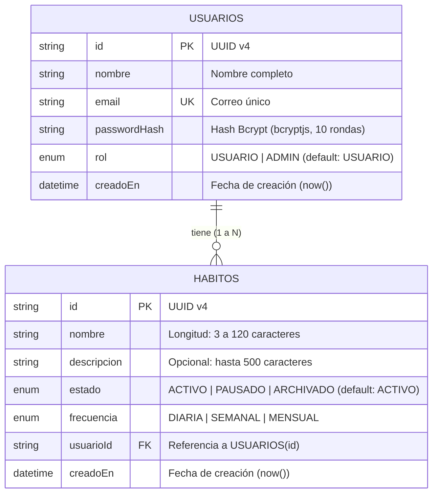

# 02. Modelo de Datos y Persistencia con Prisma

## Ritmo Claro API — Persistencia Relacional en PostgreSQL

Este documento describe la arquitectura de persistencia, entidades, enumeraciones, relaciones e índices que componen el modelo de base de datos relacional para **Ritmo Claro**.

---

## 1. Diagrama Entidad-Relación (ERD)



---

## 2. Definición de Enumeraciones (Enums)

### `Rol`
Define el nivel de autorización en el sistema:
- `USUARIO`: Rol por defecto asignado a todo participante en el registro. Solo puede gestionar sus hábitos propios.
- `ADMIN`: Rol privilegiado para soporte y operaciones. Permite auditar todos los hábitos del sistema (`GET /habitos/admin/todos`).

### `EstadoHabito`
Representa el ciclo de vida de un hábito dentro del programa:
- `ACTIVO`: El hábito se encuentra en práctica recurrente (valor por defecto al crear).
- `PAUSADO`: El usuario detiene temporalmente la práctica sin descartarla.
- `ARCHIVADO`: El hábito ya no se realiza pero se conserva su historial.

### `FrecuenciaHabito`
Establece la periodicidad del hábito acordada con el usuario:
- `DIARIA`: Se realiza todos los días (ej. meditación matutina, hidratación).
- `SEMANAL`: Se realiza en días específicos de la semana (ej. revisión de metas, ejercicio).
- `MENSUAL`: Se realiza una vez al mes (ej. evaluación de bienestar personal).

---

## 3. Especificación de Entidades

### Entidad `Usuario` (Tabla: `usuarios`)

| Campo | Tipo de Dato | Modificadores | Descripción |
| :--- | :--- | :--- | :--- |
| `id` | `String` | `@id`, `@default(uuid())` | Identificador único universal (UUID v4) que previene enumeración. |
| `nombre` | `String` | `NOT NULL` | Nombre o alias del colaborador. |
| `email` | `String` | `@unique`, `NOT NULL` | Correo electrónico corporativo o personal, único en todo el sistema. |
| `passwordHash` | `String` | `NOT NULL` | Hash seguro generado con bcrypt (mínimo 10 salt rounds). Nunca expuesto en respuestas. |
| `rol` | `Rol` | `NOT NULL`, `@default(USUARIO)` | Privilegio de acceso en la plataforma. |
| `creadoEn` | `DateTime` | `NOT NULL`, `@default(now())` | Marca de tiempo de registro. |
| `habitos` | `Habito[]` | Relación 1:N | Lista de hábitos creados por este usuario. |

### Entidad `Habito` (Tabla: `habitos`)

| Campo | Tipo de Dato | Modificadores | Restricciones de Dominio | Descripción |
| :--- | :--- | :--- | :--- | :--- |
| `id` | `String` | `@id`, `@default(uuid())` | UUID v4 | Identificador único del hábito. |
| `nombre` | `String` | `NOT NULL` | Mín. 3, Máx. 120 caracteres | Nombre de la acción (ej: "Pausa activa 10 min"). |
| `descripcion`| `String?` | Opcional | Máx. 500 caracteres | Detalles adicionales o instrucciones del hábito. |
| `estado` | `EstadoHabito` | `NOT NULL`, `@default(ACTIVO)` | Enum: ACTIVO, PAUSADO, ARCHIVADO | Estado actual del hábito. |
| `frecuencia` | `FrecuenciaHabito` | `NOT NULL` | Enum: DIARIA, SEMANAL, MENSUAL | Periodicidad de realización. |
| `usuarioId` | `String` | `NOT NULL`, FK | Indexado | ID del usuario propietario. |
| `creadoEn` | `DateTime` | `NOT NULL`, `@default(now())` | Fecha actual | Marca de tiempo de creación. |

---

## 4. Esquema Completo de Prisma (`prisma/schema.prisma`)

```prisma
datasource db {
  provider = "postgresql"
  url      = env("DATABASE_URL")
}

generator client {
  provider = "prisma-client-js"
}

enum Rol {
  USUARIO
  ADMIN
}

enum EstadoHabito {
  ACTIVO
  PAUSADO
  ARCHIVADO
}

enum FrecuenciaHabito {
  DIARIA
  SEMANAL
  MENSUAL
}

model Usuario {
  id           String    @id @default(uuid())
  nombre       String
  email        String    @unique
  passwordHash String
  rol          Rol       @default(USUARIO)
  creadoEn     DateTime  @default(now())
  habitos      Habito[]

  @@map("usuarios")
}

model Habito {
  id          String           @id @default(uuid())
  nombre      String
  descripcion String?
  estado      EstadoHabito     @default(ACTIVO)
  frecuencia  FrecuenciaHabito
  usuarioId   String
  usuario     Usuario          @relation(fields: [usuarioId], references: [id], onDelete: Cascade)
  creadoEn    DateTime         @default(now())

  @@index([usuarioId])
  @@map("habitos")
}
```

---

## 5. Decisiones Técnicas de Persistencia

1. **Uso de UUIDs v4:**
   - Previene ataques de enumeración (evita que un usuario adivine si existe `/habitos/1`, `/habitos/2`, etc.).
   - Facilita la generación distribuida y consistente en entornos distribuidos o microservicios.

2. **Índice en `usuarioId` (`@@index([usuarioId])`):**
   - La regla no negociable de privacidad exige que toda consulta a la tabla `habitos` filtre por `usuarioId`.
   - El índice B-Tree en `usuarioId` garantiza búsquedas $O(\log n)$ ultrarrápidas al listar y validar la propiedad del recurso.

3. **Integridad Referencial con Eliminación en Cascada (`onDelete: Cascade`):**
   - Si una cuenta de usuario es eliminada, todos sus hábitos asociados se depuran atómicamente, evitando registros huérfanos.

4. **Estrategia de Inicialización (Seed):**
   - El archivo `prisma/seed.ts` creará un usuario administrador inicial con contraseña hasheada para facilitar las pruebas del rol `ADMIN`.
