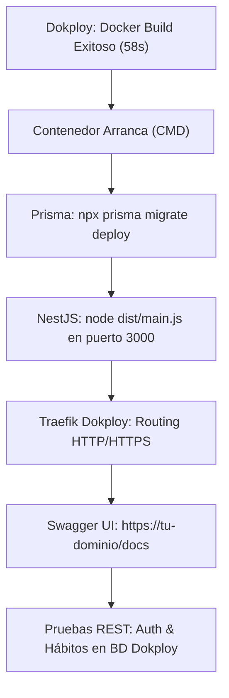

# Plan de Implementación: Parte 10 — Verificación en Dokploy y Entrega Final

Tras haber completado con éxito la construcción y empaquetado de la imagen Docker en Dokploy (`✅ Docker build completed` en 58s), esta fase final tiene como propósito validar que el contenedor arranque en producción, aplique las migraciones de Prisma sobre la base de datos de Dokploy y responda correctamente a través de la URL asignada.

---

## 1. Objetivos de la Parte 10

1. **Confirmar el arranque del contenedor en Dokploy:**
   - Verificar en los logs de runtime de Dokploy que `npx prisma migrate deploy` ejecutó las migraciones pendientes sin errores.
   - Confirmar que NestJS inició en el puerto `3000` y está a la escucha.
2. **Configuración de Dominio y SSL en Dokploy:**
   - Asignar un dominio o subdominio en la pestaña **Domains** de Dokploy apuntando al puerto `3000`.
   - Activar el certificado SSL/HTTPS automático generado por Traefik en Dokploy.
3. **Verificación de Endpoints en Producción:**
   - Comprobar la interfaz interactiva de Swagger en `https://<tu-dominio>/docs`.
   - Probar el flujo de autenticación en producción:
     - `POST /auth/register` (crear usuario de prueba en Dokploy).
     - `POST /auth/login` (recibir token JWT emitido por la API en la nube).
     - `POST /habitos` (crear hábito persistido en PostgreSQL de Dokploy).
     - `GET /habitos` (listar hábitos del usuario).
4. **Completar Documentación Final de Entrega:**
   - Crear el documento técnico `docs/05-guia-despliegue.md` con la arquitectura Dokploy + PostgreSQL.
   - Guardar evidencias finales en el repositorio.

---

## 2. Flujo de Verificación en Dokploy



---

## 3. Lista de Tareas Paso a Paso

### Paso 1: Revisión de Logs de Inicio en Dokploy
- En el panel de Dokploy, entra en la pestaña **Logs** de la aplicación.
- Debe mostrarse:
  ```text
  Prisma schema loaded from prisma/schema.prisma.
  Datasource "db": PostgreSQL database "...", schema "public" at "..."
  Applying migration `20261006180800_init`
  All migrations have been successfully applied.
  [Nest] ... LOG [NestApplication] Nest application successfully started
  ```

### Paso 2: Obtener o Asignar el Dominio Público
- En Dokploy -> Aplicación -> pestaña **Domains**:
  - Si aún no tienes dominio asignado, crea uno (ej. `api-ritmo.tudominio.com` o el subdominio gratuito/puerto expuesto que tengas configurado).
  - Selecciona el puerto del contenedor: `3000`.
  - Activa la casilla **HTTPS**.

### Paso 3: Probar Endpoints en la Nube
- Realizar una petición a `https://<tu-dominio>/docs` en el navegador.
- Probar un registro y login en producción para confirmar que la base de datos PostgreSQL de Dokploy está escribiendo y leyendo correctamente.

### Paso 4: Generar Guía de Despliegue y Commit
- Crear `docs/05-guia-despliegue.md`.
- Sincronizar el repositorio con `git commit` y `git push`.
