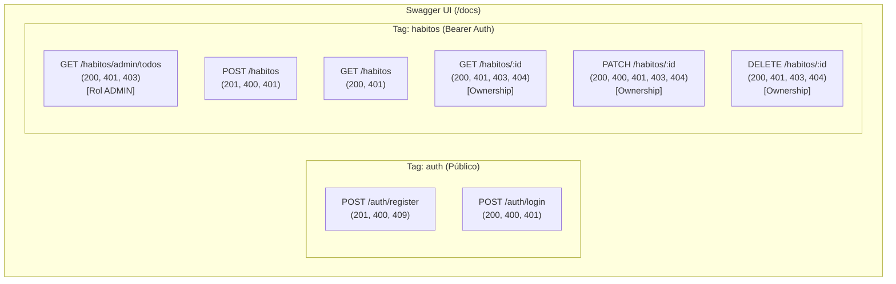

# Plan de Implementación — Parte 8: Documentación Interactiva (Swagger/OpenAPI) y Pruebas Integrales (Postman)

## Propósito
Convertir el comportamiento completo de la API en un contrato interactivo y navegable mediante OpenAPI/Swagger en `/docs`, documentando con precisión entradas, salidas, tipos y códigos de estado para los 8 endpoints del sistema, y proporcionar una suite reproducible en Postman (`postman/Ritmo-Claro.postman_collection.json`) sin secretos ni tokens quemados, validando la matriz completa de pruebas con dos usuarios regulares y un administrador bajo criterios de accesibilidad documental.

---

## 1. Análisis del Estado Actual vs. Requisitos

| Componente | Requisito Parte 8 | Estado Actual | Acción en Parte 8 |
| :--- | :--- | :--- | :--- |
| **Ruta Swagger `/docs`** | Configurar Swagger en `/docs` con título, versión, agrupación por tags (`auth`, `habitos`) y Bearer auth. | `@nestjs/swagger` está instalado pero no inicializado en `src/main.ts`. | Configurar `DocumentBuilder` y `SwaggerModule.setup('docs', app, document)` en `src/main.ts`. |
| **8 Endpoints en `/docs`** | Visibilidad y detalle completo de los 8 endpoints del sistema. | Los endpoints no tienen decoradores Swagger (`@ApiOperation`, `@ApiResponse`). | Decorar `AuthController` (2 rutas) y `HabitosController` (6 rutas). |
| **Documentación de DTOs** | Campos, descripciones, restricciones, ejemplos y enums documentados. | DTOs solo tienen validaciones `class-validator`, sin metadatos OpenAPI. | Agregar `@ApiProperty` y `@ApiPropertyOptional` en `RegisterDto`, `LoginDto`, `CreateHabitoDto` y `UpdateHabitoDto`. |
| **Autenticación en Swagger** | Botón **Authorize** funcional para inyectar token JWT Bearer. | No configurado. | Configurar `.addBearerAuth(...)` con nombre `'JWT-auth'` y decorar `HabitosController` con `@ApiBearerAuth('JWT-auth')`. |
| **Colección Postman** | Archivo reproducible en `postman/Ritmo-Claro.postman_collection.json` con `baseUrl` y `token` vacíos (sin secretos). | Existe en `docs/`, pero no en `postman/` y requiere asegurar que las variables estén vacías. | Crear `postman/Ritmo-Claro.postman_collection.json` con variables parametrizadas y sin credenciales activas. |
| **Guía en `README.md`** | Instrucciones claras para iniciar API, abrir Swagger en `/docs` y ejecutar Postman. | Contiene plantilla por defecto de NestJS. | Reemplazar con guía completa del proyecto, arquitectura, endpoints y manual de pruebas. |
| **Accesibilidad Documental** | Reporte con títulos descriptivos, orden lógico y evidencia identificable por texto y código HTTP (no solo colores). | Pendiente de consolidar reporte final con fecha, entorno y matriz. | Generar matriz formal con fecha, entorno y evidencia textual clara. |

---

## 2. Mapa de los 8 Endpoints para Swagger y Postman

---

## 3. Plan de Trabajo Paso a Paso

### Paso 1: Configurar Swagger en `src/main.ts`
- Importar `DocumentBuilder` y `SwaggerModule`.
- Configurar:
  - Título: `Ritmo Claro API`
  - Descripción: `API RESTful para gestión de hábitos personales, control de propiedad y roles de usuario.`
  - Versión: `1.0.0`
  - Tags: `auth` y `habitos`.
  - Seguridad Bearer: `addBearerAuth` con configuración `type: 'http', scheme: 'bearer', bearerFormat: 'JWT'`.
  - Exposición en ruta `/docs`.

### Paso 2: Anotar DTOs con `@ApiProperty`
- **`src/auth/dto/register.dto.ts`**: Documentar `nombre` (mín 2, máx 100), `email`, `password` (mín 8) con ejemplos claros.
- **`src/auth/dto/login.dto.ts`**: Documentar `email` y `password`.
- **`src/habitos/dto/create-habito.dto.ts`**: Documentar `nombre` (3-120), `descripcion` (hasta 500), `estado` (enum `EstadoHabito`), `frecuencia` (enum `FrecuenciaHabito`).
- **`src/habitos/dto/update-habito.dto.ts`**: Verifica herencia automática de metadatos vía `PartialType`.

### Paso 3: Anotar Controladores
- **`src/auth/auth.controller.ts`**:
  - `@ApiTags('auth')`
  - `@ApiOperation` y `@ApiResponse` para `/register` (201, 400, 409) y `/login` (200, 400, 401).
- **`src/habitos/habitos.controller.ts`**:
  - `@ApiTags('habitos')`
  - `@ApiBearerAuth('JWT-auth')`
  - Documentar las 6 operaciones con sus respectivos códigos HTTP, parámetros `@ApiParam({ name: 'id', format: 'uuid' })` y descripciones de negocio (Ownership y RBAC).

### Paso 4: Crear la Colección de Postman Sanitizada
- Crear el directorio `postman/` si no existe.
- Guardar `postman/Ritmo-Claro.postman_collection.json`.
- Configurar variables a nivel de colección:
  - `baseUrl`: `http://localhost:3000`
  - `token`: `""` (vacío, sin tokens activos)
  - `adminToken`: `""` (vacío)
  - `habitoId`: `""` (vacío)
- Estructurar en carpetas lógicas:
  1. `1. Autenticación (Público)`
  2. `2. CRUD Hábitos (Usuario A)`
  3. `3. Control de Acceso y Propiedad (Usuario B vs Usuario A)`
  4. `4. Roles y Administración (ADMIN)`
  5. `5. Pruebas de Validación y Errores (400, 401, 403, 404, 409)`

### Paso 5: Actualizar `README.md`
- Redactar un `README.md` profesional en español que incluya:
  - Descripción general del proyecto y arquitectura.
  - Requisitos y variables de entorno (`.env.example`).
  - Instrucciones de instalación (`pnpm install`) y ejecución (`pnpm start:dev`, `pnpm start:prod`).
  - Cómo abrir y explorar Swagger en `http://localhost:3000/docs` y cómo usar el botón **Authorize**.
  - Cómo importar y ejecutar la colección en Postman.
  - Tabla de endpoints y códigos HTTP devueltos.

### Paso 6: Verificación de la Matriz de Pruebas y Accesibilidad
- Ejecutar verificación automatizada completa contra los 8 endpoints en vivo.
- Presentar la matriz de pruebas con:
  - Nombre del caso y actor (Usuario A, Usuario B, ADMIN).
  - Método y ruta.
  - Código HTTP esperado vs. observado.
  - Diagnóstico textual claro (sin depender exclusivamente de colores para garantizar accesibilidad).
  - Fecha, hora y entorno de ejecución.

### Paso 7: Versionado Git
- Commit convencional: `feat: configure swagger openapi at /docs, annotate endpoints and export sanitized postman collection`.
